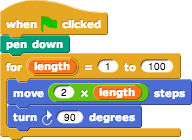
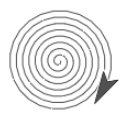

# Loops

Repeating a part of your program is a very common practice in programming. We'll call this _looping_, and there many different blocks you can use to do it in many different ways.

The  block is appropriate if you want to repeat the same behavior for... ever.  
  
The  block is great if you want to loop the same behavior a certain number of times.Sometimes, though, you want to do _almost_ the same thing for a certain number of times, but with a slight variation. For instance:

* You want to draw 20 squares on the screen, but each a different size.
* You want to draw 100 polygons with different numbers of sides.

Many such situations can be handled by the `for` block near the bottom of the Control palette:

The numbers in the `for` block work as you probably think they do: the inner script is run enough times to count from the left number \(`1`\) to the right number \(`10`\). As with the `repeat` block, you can change the numbers it comes with by default to change the way the block repeats.

What's new to you here, though, is the orange oval with "`i`" in it. By using this `i`, your inner blocks can know which time through the loop they are currently on. Here's how:

The  block is a _variable_ that acts like a counter. You use it any place you would use a number, and it will report the value that it currently holds.

Think of the _variable_ like a box with a name—this one has the name `i`. This box is made for you by the  block, and holds a different number each time through the loop. The first time it will hold `1`, or whatever is the left number in the `for` block.

You use it by dragging  from the source within the `for` block down to the slot in which you will use it.

For instance:

is the equivalent of

Click on the script below to load it in a new Snap_!_ window:

Note that we changed the name of the variable, by clicking on the orange oval _without_ dragging it.

This shape is called a "squiral" — a square spiral. Do you see why it spirals outward? The length value in the  varies between repetitions.

Try changing the turning angle to other numbers: 92, 126, etc. People might pay cash money for some of these pictures!  
  
Also, try changing the turning angle and the move length to see how close you can get to a smooth spiral:  
  

## Looping Blocks

There are times when you will want blocks to repeat. Instead of duplicating blocks and ending up with a long script that might be confusing, there are looping control blocks that you can wrap around the script you want to repeat.

* **forever** Loops until the program ends. This is basically an _**infinite loop**_ as it goes on forever.
* **repeat \(\)** Loops the specified number of times.
* **repeat until &lt; &gt;** Repeat until the condition is _True_.

For the repeat until &lt; &gt; you will use a predicate block that returns true or false. These blocks have pointed ends and can be found in the Operators palette.

Other helpful blocks include the operator blocks.

## Looping Examples

## The For Block

The repeat block is great if you want to repeat exactly the same behavior each time. Sometimes, though, you want to do almost the same thing every time, but with a slight variation. Many such situations can be handled by the for block near the bottom of the Control palette:

What’s new here is the orange oval with “i” in it. This is called a variable. It represents a different value in each repetition. Try this:

Note that we changed the numbers in the two white-oval input slots. We also dragged the variable i from the for block itself into the say block within its action slot. This “for loop” is equivalent to the following script:

Just saying the variable isn’t all that interesting.

But now try this:

Note that we changed the name of the variable, by clicking on the orange oval without dragging it. This shape is called a “squiral” — a square spiral. Do you see why it spirals outward? The length of the move varies between repetitions. If we wanted to create this shape without using **for**, the script would look like this:

By the way, try changing the turning angle from 90 to 92. It makes a beautiful picture! Then play around with the numbers and see how close you can come to a smooth spiral:

