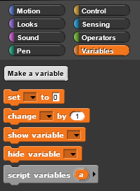
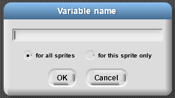
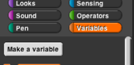
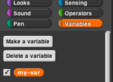

# Variables

Variables are named spaces in memory that your program can access. You can set and modify the values that are contained in these named spaces. To visualize a variable’s name space think of mail slots in a large mail room. Your computer has memory that the program is going to use to create and store information. When you create a variable, you are assigning one of the “slots” of memory to a name and then can put a value in that slot and modify it as needed.

Why create variables? Variables allow the programmer to make the value modifiable in the script. For example, you want to be able to update a score variable as the player wins/loses in a game. You will see many different uses of variables during this course.

You have multiple blocks to create and manipulate variables in the Variables tab palette.

* **Make a variable button** allows you to create a new variable
* **Delete a variable button** will allow you to delete a button – this button only shows after you have created a variable.
* **Set \[variable name\] to \(0\)** will allow you to initialize, or set a beginning value, the variable to a value.
* **Change \[variable name\] by \(1\)** allows you to modify the value of a variable
* **Show variable \[variable name\]** will show the variable and value on the stage.
* **hide variable \[variable name\]** will hide the variable and value on the stage.
* **Script variables \(a\)** will allow you to create local variables, more on this use later

### To create a variable

* In the box that pops up - type the name of the variable. The default selection “for all sprites” means that all sprites have access to this variable. Select “for this sprite only” if you want only the sprite currently selected to be able to access/modify the value of the variable.

* Now you’ll have blocks to use for your variable.
* Note that you now have a rounded button with the name of the variable in the window with a checkbox to the left. If checked, the variable and value will be show on the stage. Uncheck to hide.
* When you use one of the variable blocks you will be able to click on the combo box arrow for a list of your variables.

## Script Variables

Sometimes you need a variable in your script, but you don’t want it to step through consecutive integer values as in the for block. A more general way to handle variables uses the block

to create a variable, and the block

to give that variable a value. Both of these blocks are in the Variables palette. Here’s an example:

The script variables block creates a variable called sides \(click on the orange “a” to change the name\) that can be used throughout this script. \(Each time you click the green flag, a new variable is created, and it exists only during that time through the script.\) The set block says what value the variable should have. In this case, Snap! will pick a random integer value between 3 and 10 \(inclusive\). \(The pick random block is in the Operators palette; note that we changed the first input from 1 to 3.\) The script will draw a regular polygon with that number of sides. The value of sides is used twice, first in the repeat block to say how many times the move-and-turn combination should be done, and again in computing the angle through which to turn for each side.

Try running the script \(by clicking the green flag\) several times to see what shapes it draws.

We needed the script variable in this script because the randomly chosen number is used twice. If it had been used only once, we could have put the pick random block directly in the script, like this:

## Global Variables

Sometimes it’s not good enough to remember a value inside one script. Instead, you need the value available everywhere in your project. The classic example is the score in a video game; even when no script is running, the score should be remembered.

There was a time, in the early history of programming languages, when all variables were global. This led to a lot of bugs, because different parts of the program would use the same name for different purposes and erase each others’ saved values. So don’t use global variables as your first choice; think whether a script variable or a for block \(which makes a variable local to just that block\) would work instead.

To make a global variable, you must go to the Variables palette and click on the Make a variable button \(not a block – you can’t put it into a script!\):

You will be prompted to give your variable a name. After you do that, you’ll see an orange variable oval in the Variables palette:

This can be dragged into scripts just like the orange variable ovals in the for block and the script variables block.

The checkbox to the left of the variable block determines whether or not the value of the variable is displayed on the stage. The variable watcher \(which is what that display is called\) can be useful for debugging, or can be displayed permanently so that the user of your project can see the score, or whatever you have in the variable. By right-clicking on the watcher, you can change the format in which it appears on the screen.

When you make a global variable, you also get a “Delete a variable” button that can be used for the obvious purpose.

