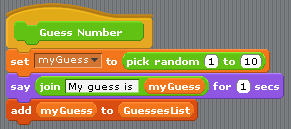
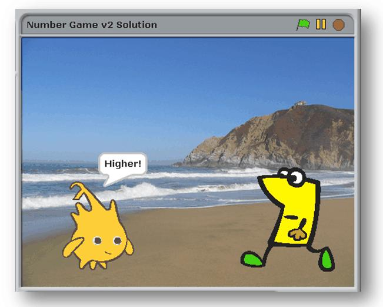

# Lab - Guessing Game

In this lab you will create a guessing game. This game will draw on what we’ve learned in the past two labs and work with variables and conditionals.

Look at the script below. The computer chooses a random number and then asks the player to guess the random number.


### Pseudocode

* Pseudocode is a mix of English language and code that represents what you want your program to do. 
* It helps you determine how you want the program to work as well as what variables and methods/functions you will want to include. 
* Developing pseudocode will help you work through your logic, reducing the number of errors and potential re-writes you will have to do.

### Pseudocode Example

Represents the same process for dealing with a guessing game in which the computer generates a random number and the player guesses the number.

```bash
When flag clicked
    Set the secret number between 1 and 10
    Repeat forever
        Ask player for guess and wait
        If guess = secret number Then 
            Display “Correct” 
            Stop Script
        
```

### Step 0

Before beginning to build your program, let’s look at what variables we will need to begin the game.

* The secret number
* The guess from the player

Next, we need to figure out the tasks that the sprite and player will be enacting.

* The Sprite will begin by setting up the game’s variables and choosing the secret number.
* The Sprite will ask for a guess from the player.
* The player will input their guess.
* If the player’s guess was correct, the sprite will give the player a message and the game will end.

Note that there is a new block above that will return a random number between the two input numbers \(inclusive\). This block is in the Operator palette. You can enter a number or use a variable. Because this is a reporter block you can use it inside other blocks as an input.


The game is pretty basic, though. In the next few steps, we are going to make the game much more like playing the number-guessing game with a person. Here are tasks to try to make the code act more like a human. Try each of these in order. When you are done, your finished code should be able to deal with all of the tasks.

### Step 1

Add to your beginning script the blocks so that the sprite welcomes the player and asks for their name before beginning.


### Step 2

We want to give the player more information if they don’t guess correctly. Have the sprite tell the player if the secret number is bigger or smaller than the number that they guessed.

### Step 3

Right now, the sprite always picks a number between 1 and 10. Change this so that the sprite always picks a number between 1 and a variable named max. \(Don’t forget to add the variable.\) Add to your script so that it asks the player what they would like the maximum number to be, before choosing a random number. Use this maximum number as the highest number that the sprite will choose.

### Step 4

Now let’s keep track of how many guesses it takes before the player guesses the right number. You will need a new variable for this task and will need to add to it every time a guess occurs.

### Step 5

When the player guesses the secret number, tell them how many guesses it took, and congratulate them using their name.

## **Lab- Guessing Game version 2.0**

The Number Guessing Game that you just created had you utilize IF statements and random number generators. This week, you will expand upon that game and make it smarter! The goal of this Expanded Guessing Game \(we’ll call it, version 2.0\) is to make sprites that play the game smarter! In addition, since this will make the game much faster, we’ll make the guessing sprite have to get three guesses right to win.

Open your Guessing Game project from the last unit to use as a reference. Create a new project called yourLastName\_GuessingGame2. This version will use two sprites: one to hold the secret number and give hints and the other to try to guess the secret.

### Step 0

Before beginning to build your program, let’s look at what variables we will need and what each sprite should do to play the game.

Variables:

* The guess from the guesser sprite
* List to hold the guesses
* The number of times the guesser sprite has guessed
* The secret number
* The number of times the guessing sprite wins

Tasks: \* The First Sprite \(the guide\) needs to initialize the variables by setting them to 0 and picking a secret number.

* The First Sprite asks the second Sprite to guess.
* The Second Sprite \(the guesser\) guesses a number.
* The Second Sprite adds its guess to a list.
* The First Sprite gives a hint based on the guess.
* Repeat the second through fifth step until the guess is correct.
* Repeat the program until the second sprite wins three times.

### Step 1

You will need to set up your ‘Game Guide’ sprite \(or sprite 1\) that will be asking for the guess just as it did in your last lab. Review the task list above if needed. The sprite will need to first set up all variables \(don’t forget to initialize\) then repeatedly ask for a guess checking to see it the secret number is guessed or if a hint should be displayed. When the secret number is guessed, you want to stop and tell the number of guesses it took to win that game \(and maybe say “Congrats” or another message\). Go ahead and set up this part of your script. Don’t forget you will need to ‘ask’ the guessing sprite for its guess. What is a good way to do this? How have you communicated with another sprite earlier?

### Step 2

Let’s create a Give Hint procedure and move the blocks that handle this task into the blocks editor. Now just add the Give Hint procedure into your sprite 1’s script where it should be.

### Step 3

Now let’s work with the guessing sprite to add a list of the guesses. Remember a list is a collection that can contain multiple values of information. Think of a list as a container for multiple values. You can add, search for, and remove information from a list. Lists are very powerful data structures, and have many uses in Computer Science! For our lab, we’ll make a simple list to store the guesses that our sprite has made so far.

To create a list, click “Make a Variable” in the Variables Tab.

 

Call your list variable whatever you like. The name should be something descriptive and informative though. In the example above, we named the list “GuessesList”.

Now we are going to tell BYOB/SNAP that the variable is a list. Notice that when you click on the set command, you will see the variable show a list as its contents \(it will not be a list until you click on the set command\).


### Step 4

Let’s make a procedure called Guess Number for the guessing sprite to guess the number. To do that select the guessing sprite and click Make a Block in the Variables palette. Let’s look at the algorithm for this new block. We want the sprite to guess a number between 1 and 10 \(inclusive\) and say the number.

Will you need a variable to hold the guess?

#### Algorithm \(Pseudocode\)

To Guess Number:  
 Set the guess to a random number between 1 and 10, inclusive  
 Say the guess.

#### Code Script in Blocks Editor


Add the code into the Block Editor. Click the block in the sprite’s window to make certain it works as expected.

### Step 5

Now let’s expand this procedure so that it will keep track of the guesses this sprite has already guessed so that the sprite does not guess the same number twice. In order to do this task, we will want to keep a list of all the guesses \(myGuess\).

First, drag the add \(thing\) to \(\) block into your block editor. The “add ‘thing’ to…” block will add the myGuess value to your list. This is a very useful block that you’ll likely use in the future as well \(hint hint\). The “thing” can be replaced by either something you specify, or a variable. In this case, we want to add the number that we’ve just guessed to the list. Drag the variable “myGuess” into the Block Editor and snap it into the ‘thing’ field. It should look like this now:



So now our block will pick a random number, say it, and add it to a list. This doesn’t quite yet accomplish what we need. What we want is for the “Guess Number” function to only choose a number as long as it hasn’t already been guessed. What we need here is a loop with an IF statement! You will need to add this in Try It! \#1.

### Try It! Guessing Game v. 2

#### Try It \#1

Expand the “Guess Number” function in the guessing sprite so that it only says the guess and adds it to the list as long as the value of myGuess is not already in the list. This block with an IF block may come in handy.


#### Try It \#2

Next, let’s expand the script we have in the original sprite \(not the guessing sprite\). Add an additional loop around the game so that the “repeat until” loop keeps running until the guessing sprite has guessed the secret number correctly \(or won\) 3 times. You may need a wins variable for this \(hint\).

Run your game. Make sure the check mark beside your guesses list is checked, and you can see the list of guesses populate itself on the stage as the guessing sprite adds guesses to its list! Notice that as guesses fills up, it takes the guessing sprite a bit longer to guess. This is because the guessing sprite is making sure that he does not guess a number he’s already guessed! Unless your guessing sprite is very lucky, once guesses fills up, the guessing sprite will freeze and stop guessing. Why is this?

Fix the game so that the guessing sprite doesn’t freeze! The way we have it now, once the guessing sprite wins, the guesses list is NOT cleared. The sprite should reset the guess list after winning! In addition, you’ll notice that guesses does not reset when you restart the game. The list should also be cleared when the game starts. On top of that, all of the variables should be reset when the game starts!

This block should help: 

#### Try It \#3

Let’s make the guessing sprite smarter! If you were playing a guessing game with someone and had guessed 3 and was told it was too low, would you guess 3 or lower? Of course not, you would guess 4 or above. Instead of guessing between 1 and 10, now you want the guessing sprite to guess between two values that will vary as guesses are made. If you want values to vary, maybe we should use variables to determine the low and the high for our guessing sprite to guess between.

So, give the same logic to the guessing sprite.

#### Try It \#4

**Test your game!**




