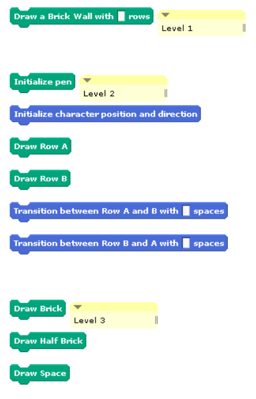

# Lab - Abstraction

### Build a Wall

We are going to draw this brick wall.

This project is not just about drawing; it is also about practicing abstraction. You will draw the following brick wall by implementing the blocks listed below.

_Note: You must implement these blocks and adhere to the abstraction described below._

There are two kinds of rows in this brick wall:

The big idea is that there are three levels of abstraction. Start creating your new blocks at Level 3, then create for Level 2 \(using your new blocks from Level 1\), and then create Level 1 using your Level 2 blocks.

_Note: a “brick” is just a thick line._

#### At the lowest level of abstraction \(Level 3\):

* You need to figure out how to draw individual bricks, small bricks and spaces. The bricks are simply thick lines.
* This level of abstraction contains the following blocks:
* The Draw Brick block, which draws a single brick.
* The Draw Small Brick block, which draws the small brick for the edges of row B. Note that this brick will not be exactly half as long as the full brick. Part of this assignment is figuring out how long the “small brick” should be.
* The Draw Space block, which draws a space between each brick or small brick.

#### At the middle level of abstraction \(Level 2\):

* You can use the functionality provided by the bottom level of abstraction to make entire rows of bricks.
* The rows referred to as “Row A” and “Row B” should look like the rows shown above.
* This level of abstraction contains the following blocks:
* The Initialize Pen block, which should initialize the pen color and size.
* The Initialize Character Position and Direction block, which should initialize the position and direction of the character.
* The Draw Row A block, which should draw a single copy of Row A.
* The Draw Row B block, which should draw a single copy of Row B.
* The Transition between Row A and B with \_\_ space block, which should transition between the end of Row A and the beginning of Row B, leaving a space as wide as the number of pixels specified by the input argument.
* The Transition between Row B and A with \_\_ space block, which should transition between the end of Row B and the beginning of Row A, leaving a space as wide as the number of pixels specified by the input argument.

HINT: You will need to determine if there is an even number of rows or an odd number of rows to be drawn as well as if the row being drawn is an even number or odd number one. You can use the **mod** block to help.

Example: if TotalNumberOfRows mod 2 = 0 then the total number of rows is even \(any even number divided by 2 leaves a remainder of 0\). You can use the same logic to determine if the row to be drawn is even or odd \(if RowNumber mod 2 = 0\).

#### At the highest level of abstraction \(level 1\)

* You will put together the full brick wall using only the functionality provided by the middle level of abstraction.
* This level of abstraction contains only the Draw a Brick Wall with \_\_ rows block, which draws a brick wall with the specified number of rows.

Note: Whenever you need to refer to a number in the program, use a variable. This is generally considered good style, because you can use the same variable in multiple places in your program, and you only need to change the value of the variable to change it in multiple places at once.

In summary, you should implement the following blocks:

### Resources





