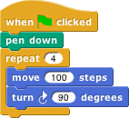
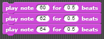
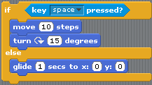

# Lab 1 - Snap Intro

Let’s first look at the IDE \(Integrated Development Environment\). You should see the following arrangement of regions in the window:

A Snap! program consists of one or more scripts, each of which is made of blocks. Here’s a typical script:

The five blocks that make up this script have three different colors, corresponding to three of the eight palettes in which blocks can be found. The palette area at the left edge of the window shows one palette at a time, chosen with the eight buttons just above the palette area. In this script, the gold blocks are from the Control palette; the green block is from the Pen palette; and the blue blocks are from the Motion palette. A script is assembled by dragging blocks from a palette into the scripting area in the middle part of the window. Blocks snap together \(hence the name Snap! for the language\) when you drag a block so that its indentation is near the tab of the one above it:

The white horizontal line is a signal that if you let go of the green block it will snap into the gold one.

If you haven’t already done so, make the script in the picture above, then find and click the green flag and see what happens.

## Hat Blocks and Command Blocks

Here’s the script from the last screen again:

At the top of the script is a hat block, which indicates when the script should be carried out. Hat block names typically start with the word “when”; in this example, the script should be run when the green flag near the right end of the Snap! tool bar is clicked. \(The Snap! tool bar is part of the Snap! window, not the same as the browser’s or operating system’s menu bar.\) A script isn’t required to have a hat block, but if not, then the script will be run only if the user clicks on the script itself. A script can’t have more than one hat block, and the hat block can be used only at the top of the script; its distinctive shape is meant to remind you of that.

The other blocks in this script are command blocks. Each command block corresponds to an action that Snap! already knows how to carry out. For example, the block “move 10 steps” tells the sprite \(the arrowhead shape on the stage at the right end of the window\) to move ten steps \(a step is a very small unit of distance\) in the direction in which the arrowhead is pointing. We’ll see shortly that there can be more than one sprite, and that each sprite has its own scripts. Also, a sprite doesn’t have to look like an arrowhead, but can have any picture as a costume. The shape of the move block is meant to remind you of a Lego™ brick; a script is a stack of blocks. \(The word “block” denotes both the graphical shape on the screen and the procedure, the action, that the block carries out.\)

The number 10 in the move block above is called an input to the block. By clicking on the white oval, you can type any number in place of the 10. The sample script above uses 100 as the input value. We’ll see later that inputs can have non-oval shapes that accept values other than numbers. We’ll also see that you can compute input values, instead of typing a particular value into the oval. A block can have more than one input slot. For example, the glide block located about halfway down the Motion palette has three inputs. Most command blocks have that brick shape, but some, like the repeat block in the sample script, are C-shaped. Most C-shaped blocks are found in the Control palette. The slot inside the C shape is a special kind of input slot that accepts a script as the input. In the sample script, the repeat block has two inputs: the number 4 and the script “move 100 steps, turn 90 degrees” .

## Some Starting Lingo

| **Term** | **Example/Description** |
| :--- | :--- |
| **Tabs \(for blocks\)** |  |
| **Tabs \(for sprite\)** |  |
| **Blocks** |  |
| **Script** |  |
| **Sprite** |  |
| **Costumes \(Each sprite can have multiple costumes\)** |  |
| **Stage** |  |

## Stage Coordinates

## Drawing Tools

There are multiple blocks that can be used to draw. By combining blocks from the Pen palette with blocks from the Motion palette, you can draw pictures. Your sprite needs to face in the direction you want the line to be drawn so you will need the point in direction \(\) block.

## Drawing shapes

Look at the following scripts to draw a square. By using the pen down block your sprite will draw for you.

