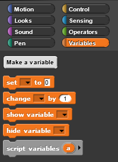
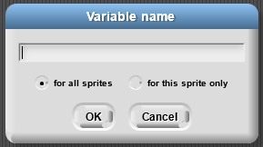
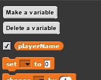
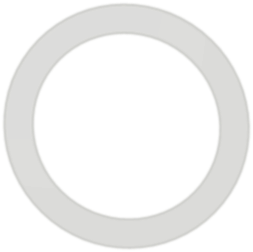

# Lab 1: Welcome to Visual Programming

Open up Snap! at [https://snap.berkeley.edu/snap/](https://snap.berkeley.edu/snap/)

Let’s first look at the IDE \(Integrated Development Environment\). You should see the following arrangement of regions in the window:

A Snap! program consists of one or more scripts, each of which is made of blocks. Here’s a typical script:

The five blocks that make up this script have three different colors, corresponding to three of the eight palettes in which blocks can be found. The palette area at the left edge of the window shows one palette at a time, chosen with the eight buttons just above the palette area. In this script, the gold blocks are from the Control palette; the green block is from the Pen palette; and the blue blocks are from the Motion palette. A script is assembled by dragging blocks from a palette into the scripting area in the middle part of the window. Blocks snap together \(hence the name Snap! for the language\) when you drag a block so that its indentation is near the tab of the one above it:

The white horizontal line is a signal that if you let go of the green block it will snap into the gold one.

If you haven’t already done so, make the script in the picture above, then find and click the green flag and see what happens.

## Hat Blocks and Command Blocks

Here’s the script from the last screen again:

At the top of the script is a hat block, which indicates when the script should be carried out. Hat block names typically start with the word “when”; in this example, the script should be run when the green flag near the right end of the Snap! tool bar is clicked. \(The Snap! tool bar is part of the Snap! window, not the same as the browser’s or operating system’s menu bar.\) A script isn’t required to have a hat block, but if not, then the script will be run only if the user clicks on the script itself. A script can’t have more than one hat block, and the hat block can be used only at the top of the script; its distinctive shape is meant to remind you of that.

The other blocks in this script are command blocks. Each command block corresponds to an action that Snap! already knows how to carry out. For example, the block “move 10 steps” tells the sprite \(the arrowhead shape on the stage at the right end of the window\) to move ten steps \(a step is a very small unit of distance\) in the direction in which the arrowhead is pointing. We’ll see shortly that there can be more than one sprite, and that each sprite has its own scripts. Also, a sprite doesn’t have to look like an arrowhead, but can have any picture as a costume. The shape of the move block is meant to remind you of a Lego™ brick; a script is a stack of blocks. \(The word “block” denotes both the graphical shape on the screen and the procedure, the action, that the block carries out.\)

The number 10 in the move block above is called an input to the block. By clicking on the white oval, you can type any number in place of the 10. The sample script above uses 100 as the input value. We’ll see later that inputs can have non-oval shapes that accept values other than numbers. We’ll also see that you can compute input values, instead of typing a particular value into the oval. A block can have more than one input slot. For example, the glide block located about halfway down the Motion palette has three inputs. Most command blocks have that brick shape, but some, like the repeat block in the sample script, are C-shaped. Most C-shaped blocks are found in the Control palette. The slot inside the C shape is a special kind of input slot that accepts a script as the input. In the sample script, the repeat block has two inputs: the number 4 and the script “move 100 steps, turn 90 degrees” .

## Some Starting Lingo

| **Term** | **Example/Description** |
| :--- | :--- |
| **Tabs \(for blocks\)** |  |
| **Tabs \(for sprite\)** |  |
| **Blocks** |  |
| **Script** |  |
| **Sprite** |  |
| **Costumes \(Each sprite can have multiple costumes\)** |  |
| **Stage** |  |

## Variables

Variables are named spaces in memory that your program can access. You can set and modify the values that are contained in these named spaces. To visualize a variable’s name space think of mail slots in a large mail room. Your computer has memory that the program is going to use to create and store information. When you create a variable, you are assigning one of the “slots” of memory to a name and then can put a value in that slot and modify it as needed.

Why create variables? Variables allow the programmer to make the value modifiable in the script. For example, you want to be able to update a score variable as the player wins/loses in a game. You will see many different uses of variables during this course.

You have multiple blocks to create and manipulate variables in the Variables tab palette.

* **Make a variable button** allows you to create a new variable
* **Delete a variable button** will allow you to delete a button – this button only shows after you have created a variable.
* **Set \[variable name\] to \(0\)** will allow you to initialize, or set a beginning value, the variable to a value.
* **Change \[variable name\] by \(1\)** allows you to modify the value of a variable
* **Show variable \[variable name\]** will show the variable and value on the stage.
* **hide variable \[variable name\]** will hide the variable and value on the stage.
* **Script variables \(a\)** will allow you to create local variables, more on this use later

### To create a variable

* In the box that pops up - type the name of the variable. The default selection “for all sprites” means that all sprites have access to this variable. Select “for this sprite only” if you want only the sprite currently selected to be able to access/modify the value of the variable.

* Now you’ll have blocks to use for your variable.
* Note that you now have a rounded button with the name of the variable in the window with a checkbox to the left. If checked, the variable and value will be show on the stage. Uncheck to hide.
* When you use one of the variable blocks you will be able to click on the combo box arrow for a list of your variables.

## Script Variables

Sometimes you need a variable in your script, but you don’t want it to step through consecutive integer values as in the for block. A more general way to handle variables uses the block

to create a variable, and the block

to give that variable a value. Both of these blocks are in the Variables palette. Here’s an example:

The script variables block creates a variable called sides \(click on the orange “a” to change the name\) that can be used throughout this script. \(Each time you click the green flag, a new variable is created, and it exists only during that time through the script.\) The set block says what value the variable should have. In this case, Snap! will pick a random integer value between 3 and 10 \(inclusive\). \(The pick random block is in the Operators palette; note that we changed the first input from 1 to 3.\) The script will draw a regular polygon with that number of sides. The value of sides is used twice, first in the repeat block to say how many times the move-and-turn combination should be done, and again in computing the angle through which to turn for each side.

Try running the script \(by clicking the green flag\) several times to see what shapes it draws.

We needed the script variable in this script because the randomly chosen number is used twice. If it had been used only once, we could have put the pick random block directly in the script, like this:

## Global Variables

Sometimes it’s not good enough to remember a value inside one script. Instead, you need the value available everywhere in your project. The classic example is the score in a video game; even when no script is running, the score should be remembered.

There was a time, in the early history of programming languages, when all variables were global. This led to a lot of bugs, because different parts of the program would use the same name for different purposes and erase each others’ saved values. So don’t use global variables as your first choice; think whether a script variable or a for block \(which makes a variable local to just that block\) would work instead.

To make a global variable, you must go to the Variables palette and click on the Make a variable button \(not a block – you can’t put it into a script!\):

You will be prompted to give your variable a name. After you do that, you’ll see an orange variable oval in the Variables palette:

This can be dragged into scripts just like the orange variable ovals in the for block and the script variables block.

The checkbox to the left of the variable block determines whether or not the value of the variable is displayed on the stage. The variable watcher \(which is what that display is called\) can be useful for debugging, or can be displayed permanently so that the user of your project can see the score, or whatever you have in the variable. By right-clicking on the watcher, you can change the format in which it appears on the screen.

When you make a global variable, you also get a “Delete a variable” button that can be used for the obvious purpose.

## Looping Blocks

There are times when you will want blocks to repeat. Instead of duplicating blocks and ending up with a long script that might be confusing, there are looping control blocks that you can wrap around the script you want to repeat.

* **forever** Loops until the program ends. This is basically an _**infinite loop**_ as it goes on forever.
* **repeat \(\)** Loops the specified number of times.
* **repeat until &lt; &gt;** Repeat until the condition is _True_.

For the repeat until &lt; &gt; you will use a predicate block that returns true or false. These blocks have pointed ends and can be found in the Operators palette.

Other helpful blocks include the operator blocks.

## Operators

Click the Operators tab to display a new palette of blocks. You can use these blocks to perform mathematic operations to modify a numeric variable.

You have blocks to add, subtract, multiple and divide. You also have a mod block that does remainder division as well as a round block and a square root block.

NOTE: To see what any block does, right click on a block in the palette and select help. A new window will open that will explain what that block does.

## Looping Examples

## The For Block

The repeat block is great if you want to repeat exactly the same behavior each time. Sometimes, though, you want to do almost the same thing every time, but with a slight variation. Many such situations can be handled by the for block near the bottom of the Control palette:

What’s new here is the orange oval with “i” in it. This is called a variable. It represents a different value in each repetition. Try this:

Note that we changed the numbers in the two white-oval input slots. We also dragged the variable i from the for block itself into the say block within its action slot. This “for loop” is equivalent to the following script:

Just saying the variable isn’t all that interesting.

But now try this:

Note that we changed the name of the variable, by clicking on the orange oval without dragging it. This shape is called a “squiral” — a square spiral. Do you see why it spirals outward? The length of the move varies between repetitions. If we wanted to create this shape without using **for**, the script would look like this:

By the way, try changing the turning angle from 90 to 92. It makes a beautiful picture! Then play around with the numbers and see how close you can come to a smooth spiral:

## Do-It-Yourself: Drawing Tools

There are multiple blocks that can be used to draw. By combining blocks from the Pen palette with blocks from the Motion palette, you can draw pictures. Your sprite needs to face in the direction you want the line to be drawn so you will need the point in direction \(\) block.

## Try it! Drawing shapes

Look at the following scripts to draw a square. The first script has repetitive code. In the second script, the repeating code has been replaced by using a loop.

Note: By using the pen down block your sprite will draw for you.

## Exercise: Draw a Squiral

Make a new variable Length with a looping structure to draw the “Squiral” \(Square + Spiral\) below. Note that the length the sprite moves is updating by a constant amount.

### Resources

[Looping](http://bjc-nc.github.io/bjc-course/curriculum/02-loops-and-variables/readings/05-looping-byob-video.mp4)

[Variables](http://bjc-nc.github.io/bjc-course/curriculum/02-loops-and-variables/readings/06-variables-byob-video.mp4)

