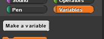
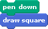
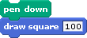
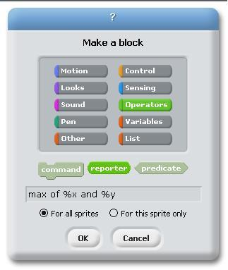
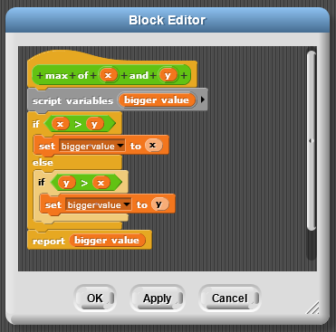
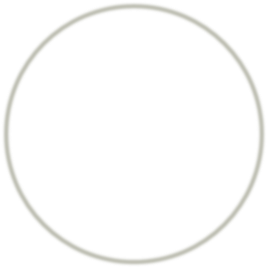
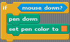

# Lab - Build a Wall

## **Follow-Along: Build Your Own Blocks**

As you have seen, Snap! is a powerful language that has a substantial repository of useful blocks for a variety of purposes. However, as you may have noticed, Snap does not have all the blocks that you may need, and often, it would prove useful if we could create new blocks.

### Make Your Own Block- A Tutorial

We are going to teach the computer how to draw a square using a block named draw square. Please follow the steps below:

* Click on make a block at the bottom of the variables tab.

* This will open up the make a block dialog box. Now, you get to choose which tab the block should go into. Our block is going to draw a square, so let us choose Motion.

* When we selected Motion, the block became blue. We now have the option of making blocks of different shapes. Right now, however, we are just going to make a \(regular\) command block.

* When we click OK, we should see the block editor below.

* Use the blocks from the regular menus to create a script that draws a square, as shown below.

* When you click OK, you should be able to use this block as if it were a regular block. Since you created the block as a Motion block, it will end up at the bottom of the Motion tab.

Congratulations! You have just created your own block!

### Improving the draw square block

You have created a block that draws a square, but it only draws a square where each side is of length 100 steps. It would be great if we could specify how long we wanted each side to be. We will edit the block to accept an _argument_ \(or _input_\), which tells it the length of the square it has to draw.

* We are going to go back and edit the block. Right-click on the new block and select edit to go back to the block editor.

* In the Block Editor, notice that when you move the mouse over the top row of the new block, some plus signs \(+\) show up. When you click on these plus signs, you can add more text or arguments. When you click on the text between the plus signs, you can delete or modify that text. Click on the plus sign at the far right as shown below:

* When you click on the plus sign on the far right, you should get the following dialog box. With this dialog box, we can select if we want to add input \(orange\) or more text \(blue\). We want to add the input size, so we type size, selectInput Name and click OK.

* Now, we have a variable inside our block definition.

* Drag the variable size down into the move block. Whenever we need a new copy of a variable, we just grab the copy from that variable in the top row.

* When we click OK, we will see that our draw square block now takes an argument. We can put different numbers in the blank and draw squares of different sizes!

### Make a draw shape Block

Now, you are going to make a block that takes two inputs. We want to create a draw shape block that takes a number of sides and a number of pixels for the length of each side. We will call these input arguments n and pixel. This exercise should be done with a partner, so introduce yourself to your neighbor and get started on the exercise together!

By the way, you can create the inputs to this block in exactly the same way as we did in the previous section, by clicking on the plus signs to add input; however, you can also type the names of the input as shown below.

The percent signs \(%\) indicate that the word should be an input. We want you to feel comfortable with both entry methods.

### The Max block

We will now make a different kind of block – a _reporter_ block. To demonstrate this, we will make a block called max that takes two numbers as input and reports the bigger value \(the maximum\).

* Click Make a block and select the Operators tab. We want a reporter block. This will give the block its round shape as shown above. As the name implies, reporter blocks can report a value. In the image below, you can see that we used the % shortcut for making input variables.

* This should give you a blank Block editor. We need to figure out what should be reported. To keep track of the value to be reported, we are going to make another variable. There are two ways to do this: Use a Script Variable block. You can click on the name of the variable and change it to bigger value. Alternatively, you can just report which of the two is larger.

### Input Types

Unfortunately, we have a bug with our max block! We wanted the max block to work only for numbers. Yet, you can type text in!

We are going to limit the max block to accept only numbers as arguments.

* Open the Block Editor for the max block and click on the input x

* Then, click on the right arrow in the pop-up box shown above. This will open the dialog box shown below. This allows us to specify the shape of the slot. We want a numbers-only slot \(as shown selected below\). We can also specify that we want the variable to have a _default_ value; this is similar to blocks like move that always start out with the default value 10.

* Modify both the x and y variables to take only numbers and to have the default values of 5 and 10, respectively. Your Block Editor should then look like this, with the default values shown in the header.

* When you click OK, you should be able to see your block in the Operators tab, with the default values filled in. Also, note that you will no longer be able to enter text.

Note: Maybe we _did_ want the max block to work with words! However, for the draw square and draw shape blocks, we definitely only wanted numbers. Modify those blocks to only take in numbers.

### Composition of Functions

Our custom-made blocks are blocks like any other, and we can use them in other block definitions. To demonstrate this, we are going to make a block that computes the maximum of three values

Repeat the steps from the last tutorial to make this version of the max block also only take numbers. Then, in the script for the block, we can use two copies of our max block.

### Try It! AddNumbers and JoinText

Your challenge is to create the following two blocks. You can use the same project file.

* A three-argument addition operator that only accepts numbers.

* A three-argument join operator that has the default values shown below and only accepts text.

### Predicates

We want to make our own predicate, a kind of block that reports either true or false. We have a “greater than” operator \(\), an “equal” operator \(=\), and a “less than” operator \(&lt;\), but we want a new “greater than or equal to” \(=\) operator.

* We will create the new block and select the predicate shape.

* This gives a Block Editor that has a predicate-shaped blank at the bottom. There, we need to place the predicate that we want to report.

* We can fill that in with a composition of a “greater than”, “or”, and “equal” operators. Make this with your partner and then try it out. Notice that this predicate block reports either true or false.

### Try It! Predicates: Make a between block

Create a new predicate block that determines if a number is between two other numbers. The block should return true if the first number is between the two numbers or if it is equal to either of the numbers.

### Different Kinds of Variables

We’ve seen a lot of different types of variables.

* **Normal/Global variables**: These variables are made in the regular menu and can be used ANYWHERE! The variable “score” below is an example. _These can be used by any sprite, in any block or in any script_.

* **Sprite Specific Variables**: When you create a “normal/global” variable you can select that the variable is “For this sprite only”. Then these variables will show up as variables listed below the line in the variables tab. _We recommend not using these variables in blocks._

* **Arguments to a function**: A variable set by the person calling the function. We also refer to this as “input”. _This can ONLY be used within the block editor._

* **Script Variables**: The “script variable” block gives us a variable that we can use inside of this script. _These can only be used in that particular script. The script could be a block script \(shown below\) or a regular script._

## **Project- Brick Wall**

We are going to draw this brick wall.

This project is not just about drawing; it is also about practicing abstraction. You will draw the following brick wall by implementing the blocks listed below.

_Note: You must implement these blocks and adhere to the abstraction described below._

There are two kinds of rows in this brick wall:

The big idea is that there are three levels of abstraction. Start creating your new blocks at Level 3, then create for Level 2 \(using your new blocks from Level 1\), and then create Level 1 using your Level 2 blocks.

_Note: a “brick” is just a thick line._

#### At the lowest level of abstraction \(Level 3\):

* You need to figure out how to draw individual bricks, small bricks and spaces. The bricks are simply thick lines.
* This level of abstraction contains the following blocks:
* The Draw Brick block, which draws a single brick.
* The Draw Small Brick block, which draws the small brick for the edges of row B. Note that this brick will not be exactly half as long as the full brick. Part of this assignment is figuring out how long the “small brick” should be.
* The Draw Space block, which draws a space between each brick or small brick.

#### At the middle level of abstraction \(Level 2\):

* You can use the functionality provided by the bottom level of abstraction to make entire rows of bricks.
* The rows referred to as “Row A” and “Row B” should look like the rows shown above.
* This level of abstraction contains the following blocks:
* The Initialize Pen block, which should initialize the pen color and size.
* The Initialize Character Position and Direction block, which should initialize the position and direction of the character.
* The Draw Row A block, which should draw a single copy of Row A.
* The Draw Row B block, which should draw a single copy of Row B.
* The Transition between Row A and B with \_\_ space block, which should transition between the end of Row A and the beginning of Row B, leaving a space as wide as the number of pixels specified by the input argument.
* The Transition between Row B and A with \_\_ space block, which should transition between the end of Row B and the beginning of Row A, leaving a space as wide as the number of pixels specified by the input argument.

HINT: You will need to determine if there is an even number of rows or an odd number of rows to be drawn as well as if the row being drawn is an even number or odd number one. You can use the **mod** block to help.

Example: if TotalNumberOfRows mod 2 = 0 then the total number of rows is even \(any even number divided by 2 leaves a remainder of 0\). You can use the same logic to determine if the row to be drawn is even or odd \(if RowNumber mod 2 = 0\).

#### At the highest level of abstraction \(level 1\)

* You will put together the full brick wall using only the functionality provided by the middle level of abstraction.
* This level of abstraction contains only the Draw a Brick Wall with \_\_ rows block, which draws a brick wall with the specified number of rows.

Note: Whenever you need to refer to a number in the program, use a variable. This is generally considered good style, because you can use the same variable in multiple places in your program, and you only need to change the value of the variable to change it in multiple places at once.

In summary, you should implement the following blocks:

