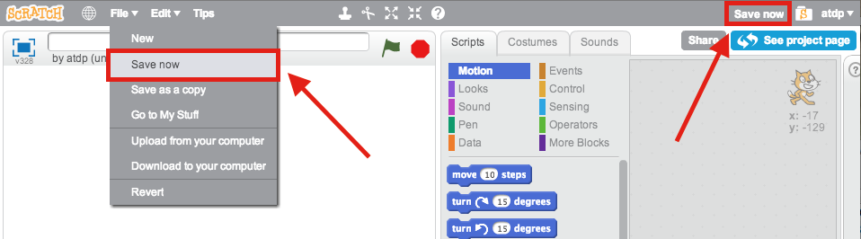

# Snap! Overview

We're going to introduce some basic computer science concepts in the programming language **Snap!**, which was developed at Berkeley and is based on its predecessor, **Scratch**, which was developed by MIT Labs.

They are both visual programming languages where you can work with blocks that translate into instructions the computer can follow. We are using Snap! because it has extensions that support more advanced features in computer science.

### Stage

The stage is in the upper left part of the Scratch editor. This is where you can see what happens when you run your scripts.

### Sprite

A sprite is a Scratch character. Each sprite has its own scripts, costumes, and sounds. Sprites are shown on the stage and in the sprites area in the bottom left part of the screen.

 and 

### Position on the Stage

The sprite occupies a point`(x,y)` on the stage corresponding to the x- and y- axis. 

You can click on the tabs on the left to see what kinds of blocks there are to build your program. Then you can click on any of the blocks in the section and drag them over onto the Scripts area. A script is just a set of instructions for the computer to follow.

#### Tabs \(for blocks\):

In the top center of the Scripts tab of the Scratch editor, there is a list of colored rectangles and types of blocks. These are the block tabs. We use them to look at lists of the different kinds of blocks.

#### Tabs \(for each Sprite\):

In the top center of the Scratch editor, there are three tabs that say "Scripts", "Costumes", and "Sounds". These are the tabs for each sprite.

#### Blocks:

Blocks are the colored pieces that we move around to make Scratch programs. Different colored blocks are used to do different things. The block color is the same color that goes with the block tab where you find that block.

#### Script:

A script is a group of connected blocks that does something when you double click on it.

#### 

#### Costume:

The appearance of the sprite on the stage. Each sprite can have multiple costumes.

### NAMING YOUR PROJECT

You can change the name of your project by filling in the box at the top of the stage, in the upper left portion of the screen. In this picture, we're naming our project "1. Repeats in a Song".

### SAVING YOUR PROJECT

It's **really** important that you save your Scratch projects often. Otherwise, you might lose something you've been working really hard on! It hurts, I promise.

To save your project in Scratch, click "Save Now"  in the upper right corner of the screen, next to your username. You can also click the "Save Now" option in the "File" menu in the upper left part of the Scratch editor.  

